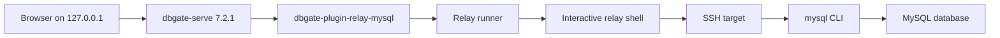

# DbGate Relay MySQL Plugin Design

Date: 2026-07-13

Status: approved in conversation; awaiting review of this written specification

## 1. Problem

The target MySQL database is not directly reachable from the local Mac. Every query must pass through an interactive relay shell, then an SSH session, and finally the remote `mysql` command-line client.

The current terminal workflow can retrieve data, but wide tables are difficult to read and there is no convenient database, table, and column browser. Direct-connection tools such as DataGrip and Navicat cannot use the existing relay path because it is not a normal TCP tunnel.

This project will preserve the working command-line access path while presenting it through DbGate Web's existing schema browser, SQL editor, and result grid.

## 2. Goals

The MVP must provide:

- A local web application available only on `127.0.0.1`.
- An independently installable `dbgate-plugin-relay-mysql` package; DbGate itself is not forked.
- A left-side browser for permitted databases, tables, and columns.
- A SQL editor for read-only, single-statement queries.
- A result grid with horizontal scrolling and resizable columns, supplied by DbGate.
- DbGate's table-data grid when a table is opened, with its default 100-row incremental load size. This is an infinite-scroll grid rather than a numbered-page control, and DbGate allows the user to change the load size.
- Reliable handling of `NULL`, XML-escaped text, newlines, and tab characters.
- A fixed 32 MiB maximum for one XML result stream in addition to the row limit.
- Clear relay, SSH, MySQL connection, SQL, timeout, and result-parsing errors.
- No persistence or logging of credentials, SQL text, or result data by this plugin.

## 3. Non-goals

The MVP will not provide:

- Data modification, DDL, transactions, or multiple SQL statements.
- Stored procedure execution, temporary tables, or session-dependent workflows.
- Import, export, schema editing, or data editing.
- A general-purpose TCP tunnel for other database clients.
- Guaranteed cancellation of a query after it has reached the remote database.
- Multiple relay profiles in one DbGate connection.
- Publication to a package registry; local installation from the repository is sufficient.
- Native MySQL protocol type fidelity for arbitrary SQL expressions.
- Guaranteed display of raw binary values or XML-invalid control characters.

Users can query binary data explicitly with functions such as `HEX(column)` when needed.

## 4. Chosen Approach

Use DbGate Web Community 7.2.1 as the UI and implement a third-party driver plugin named `dbgate-plugin-relay-mysql`.

The alternatives considered were:

1. Build a standalone database UI. This gives full control but duplicates schema browsing, editing, grid, and settings work already handled by mature tools.
2. Fork another open-source database UI. This reduces initial UI work but makes upgrades and maintenance depend on a permanent fork.
3. Add an independent DbGate driver plugin. This keeps the relay-specific code isolated while reusing DbGate's mature UI and is the selected approach.

DbGate Web is pinned for the MVP so plugin behavior is tested against one known version. Version upgrades are separate compatibility work.

## 5. Architecture



The repository owns the plugin and its relay-runner adapter. It does not own DbGate or a modified DbGate build.

### 5.1 Frontend driver

The frontend entry registers a `Relay MySQL` driver with DbGate. Its connection form contains only non-secret logical configuration, such as a relay profile name, an optional default database, and the runner executable path. Each DbGate connection fixes exactly one profile; separate DbGate connections may select different profiles. Switching profiles inside one open connection is deferred.

The form does not request or save relay, SSH, or MySQL passwords. Secret resolution belongs to the runner's process environment or another user-managed local secret source.

### 5.2 Backend driver

The backend entry implements the DbGate driver contract needed for:

- Connection testing.
- Read-only query execution.
- Table-data pagination.
- Database, table, and column metadata loading.
- MySQL identifier quoting and pagination SQL generation.

It converts runner output into the column and row events expected by DbGate's result grid.

### 5.3 Relay runner

The relay runner owns all interactive relay and SSH behavior. It adapts the existing `relay-cli -> SSH -> mysql CLI` method rather than assuming direct network access.

The plugin starts the runner with an argument array, not a shell command string. The version 1 invocation is:

```text
relay-mysql-runner \
  --protocol-version 1 \
  --request-id <opaque UUID> \
  --profile <connection profile> \
  --database <optional default database> \
  --timeout-ms 30000
```

The database argument is omitted when no default database is selected. The profile, database, deadline, request ID, and protocol version are therefore explicit and independently testable. None of these arguments contains a credential.

SQL is written to the runner's standard input and stdin is then closed. The runner constructs only a fixed remote command template and transports the SQL as encoded data, preventing SQL quotes and shell characters from changing the command structure.

The current text-oriented helper behavior is a reference, not a binary-transparent tunnel. The MVP runner remains one-shot: each DbGate query starts a fresh relay, SSH, and MySQL CLI chain.

The runner protocol is:

- stdin: one UTF-8 SQL statement.
- stdout on success: only the MySQL XML document.
- stderr on failure: one UTF-8 JSON object with `version`, `category`, `message`, and `retryable` fields. The message is sanitized and contains no raw command or query text.
- exit status: zero for success and nonzero for failure.

Raw PTY transcripts are never forwarded to application logs. The runner extracts only output between explicit result markers so echoed remote commands, prompts, and credentials cannot enter the result parser. To keep the version 1 protocol atomic, the runner buffers at most 32 MiB of extracted XML in memory and writes it to stdout only after the relay process exits successfully; on failure stdout remains empty. The DbGate backend still parses that successful output incrementally and never builds an XML DOM.

## 6. Query Flow

1. DbGate sends a query request to the backend driver.
2. The SQL gate validates that the request is one supported read-only statement.
3. The row-limit policy checks or adds a top-level limit.
4. The backend starts the relay runner and writes SQL to stdin.
5. The runner opens the relay shell, enters the SSH target, and invokes `mysql --xml --quick --binary-mode`. `--quick` prevents the remote client from buffering the full result, while `--binary-mode` disables most client-side backslash commands when SQL arrives on stdin.
6. The backend parses XML incrementally and emits DbGate result events.
7. On completion, the one-shot relay and SSH process exits.

The runner uses a 30-second default deadline for the complete operation. Killing the local runner is the cancellation boundary. The UI must state that a timed-out remote query may continue on the database until the remote connection closes or the server ends it.

## 7. XML Result Protocol

The current target's MySQL CLI was verified to advertise `-X/--xml`, and a real synthetic query through the relay and SSH chain completed successfully. This is still checked during connection testing rather than assumed for every profile.

A result has the following shape:

```xml
<?xml version="1.0"?>
<resultset statement="SELECT ..." xmlns:xsi="http://www.w3.org/2001/XMLSchema-instance">
  <row>
    <field name="id">1</field>
    <field name="nullable_value" xsi:nil="true" />
    <field name="text_value">a&lt;b&amp;c</field>
  </row>
</resultset>
```

Parsing rules are:

- Preserve field order from the XML document.
- Convert `xsi:nil="true"` to JavaScript `null`.
- Decode XML entities through the XML parser.
- Preserve newlines and tab characters in normal text values.
- Preserve every duplicate-named field by deterministically renaming later occurrences by ordinal position, for example `id`, `id__2`, and `id__3`. DbGate 7.2.1 uses the displayed `columnName` as the grid identity and removes exact duplicates, so preserving identical visible labels would require a DbGate UI change outside this plugin-only MVP.
- Ignore the `statement` attribute. It contains the full SQL and must never be retained or logged.
- Treat ordinary values as text in the MVP. Declared table-column types remain available in schema metadata, but arbitrary expression results do not have native protocol type metadata.
- An empty arbitrary query may have no column names because MySQL XML describes fields inside rows. In that case the grid shows zero rows without inferred columns; table-data tabs can still use schema metadata.
- Fail with a result-parsing error for malformed XML, raw binary data, or XML-invalid control characters; do not silently corrupt the value.

The parser must be streaming rather than DOM-based. The maximum visible result is 5,000 rows, but streaming avoids holding both the complete XML document and the complete parsed copy in memory. The backend counts raw stdout bytes before parsing and aborts the local runner when the stream exceeds 32 MiB.

### 7.1 Observed performance

The measurements below are design evidence, not an SLA:

- A small query on the verified target relay path took about 1.0-1.2 seconds end to end for both tabular and XML output. Relay and SSH setup dominated the duration.
- A synthetic 1,000-row result with an approximately 100-byte payload per row added about 60 milliseconds for XML in the sampled relay environment.
- That synthetic result was about 105 KB in tabular form and 180 KB in XML form.

The design therefore accepts XML's transfer overhead for the MVP. Avoiding metadata N+1 queries has a larger latency benefit than replacing XML. Local parser benchmarks remain part of implementation verification.

## 8. Read-only Enforcement

Read-only behavior has three layers:

1. DbGate advertises the driver as read-only and does not expose data-edit actions.
2. The plugin performs conservative SQL validation before starting the runner.
3. The runner establishes a read-only database session when supported, and the configured database account provides the actual authorization boundary.

For a hard read-only guarantee, the selected profile must use a least-privilege account without data-write, DDL, `FILE`, `EXECUTE`, temporary-table, or administrative privileges. The SQL gate prevents accidental writes but cannot prove that arbitrary stored functions or UDFs have no side effects. A profile backed by a broader account may be used only with the explicit understanding that the plugin is then a safety guard, not a security boundary.

The SQL gate accepts exactly one statement whose root form is:

- `SELECT`
- `SHOW`
- `DESC` or `DESCRIBE`
- `EXPLAIN SELECT`

It rejects:

- Any second statement or a non-terminal top-level semicolon.
- `INSERT`, `UPDATE`, `DELETE`, `REPLACE`, DDL, `CALL`, `SET`, `USE`, transaction statements, and administrative statements.
- `SELECT ... INTO`, including `INTO OUTFILE` and `INTO DUMPFILE`.
- Locking reads such as `FOR UPDATE` and `LOCK IN SHARE MODE`.
- `EXPLAIN` of anything other than a `SELECT`.
- Unquoted mysql client commands such as `DELIMITER` and `CHARSET`; the target client version still recognizes these commands under `--binary-mode`, so they cannot be allowed to alter client parsing.
- MySQL executable comments, assignment with `:=`, and high-risk functions such as `LOAD_FILE`, `GET_LOCK`, `RELEASE_LOCK`, `SLEEP`, and `BENCHMARK`.

The validator must tokenize comments, quoted strings, quoted identifiers, and parentheses correctly. A prefix regular expression alone is not sufficient.

## 9. Row Limits and Pagination

Manual `SELECT` queries return at most 5,000 visible rows.

- Without a top-level `LIMIT`, the plugin removes an optional terminal semicolon, appends `LIMIT 5001`, emits at most the first 5,000 rows, and marks the result as truncated if row 5,001 is present.
- An explicit limit of 5,000 or fewer is preserved.
- An explicit limit above 5,000 is rejected with a message asking the user to lower it.
- `SHOW`, `DESC`, and `DESCRIBE` results are locally capped at 5,000 rows.

Opening a table uses DbGate's table-data tab, not a generated editor tab. With DbGate's default setting, the backend generates MySQL `LIMIT 100 OFFSET n` queries as the user scrolls; DbGate owns the configurable load size, infinite-scroll navigation, horizontal scrolling, and column resizing. When a primary key exists, incremental loading orders by all primary-key columns in key order. Without a primary key, it uses no synthetic order and may repeat or omit rows if the table changes between requests.

## 10. Metadata Loading

The driver first lists every non-system database visible to the configured account, excluding `information_schema`, `performance_schema`, `mysql`, and `sys`. DbGate 7.2.1 then creates a database-scoped connection process for each selected database. Within that process, the metadata analyser loads the database's tables or views and columns from `information_schema` in one snapshot operation rather than one relay session per table.

The snapshot includes:

- Schema name.
- Object name and table/view kind.
- Column name, ordinal position, declared data type, nullability, and key flags needed by DbGate.

Successful snapshots are cached only in memory for five minutes. The cache key contains the DbGate connection identity, relay profile, runner path, and selected database; the TTL begins when a complete snapshot succeeds. A manual refresh invalidates only that key.

If a refresh fails, the analyser does not replace its last successful cache entry and returns a sanitized error through DbGate's existing connection/schema error path. DbGate displays its standard error notification while leaving the previously rendered tree unchanged. The plugin does not add a custom stale field or require a DbGate UI fork. If there has never been a successful snapshot, the UI shows the error and no fabricated objects.

## 11. Error Model

Errors are mapped to stable categories:

- `relay_login`: relay CLI could not start or authenticate.
- `ssh`: SSH login or remote shell failed.
- `mysql_connection`: MySQL client startup or database authentication failed.
- `sql_rejected`: the local read-only gate rejected the statement.
- `sql_error`: MySQL returned a SQL error.
- `timeout`: the local operation exceeded its deadline.
- `parse`: output was not valid supported XML.
- `result_too_large`: stdout exceeded the fixed 32 MiB result limit.
- `runner`: the runner protocol or local executable failed.

User-facing messages contain a query ID and safe remediation guidance. Diagnostic logs may contain only the query ID, duration, row count, exit status, and error category. They must not contain SQL, XML, result values, credentials, remote command text, or raw PTY output.

## 12. Local Deployment

The MVP runs `dbgate-serve` and the plugin on the user's Mac.

- Pin DbGate Web Community to 7.2.1.
- Start DbGate through a repository-provided preload wrapper that binds the HTTP listener to `127.0.0.1`. DbGate 7.2.1's NPM entry calls `server.listen(port)` and does not honor a host environment variable, so the wrapper injects the loopback host before loading `dbgate-serve`; an integration test verifies the actual bound address.
- Install the plugin through DbGate's external plugin directory; do not rebuild DbGate.
- Keep relay and database secrets outside the repository and DbGate connection records.
- Provide a connection test that checks the runner executable, relay path, SSH path, MySQL CLI XML support, and `SELECT 1`.

## 13. Testing Strategy

### 13.1 Unit tests

- SQL tokenizer and allow/deny rules, including comments, quotes, semicolons, `INTO`, and locking reads.
- Row-limit detection and rewriting.
- XML parsing for `NULL`, entities, Unicode, newlines, tabs, empty strings, duplicate names, malformed XML, and invalid control data.
- Metadata snapshot mapping and five-minute cache behavior.
- Error-category mapping and log redaction.

### 13.2 Integration tests with a fake runner

- Successful multi-row, zero-row, and truncated-result event conversion.
- Slow runner timeout and local child termination.
- Each runner exit category and malformed stdout.
- Stale metadata fallback.
- Verification that SQL travels over stdin and does not appear in process arguments or logs.

### 13.3 Real-path smoke tests

Real-path tests use only synthetic queries and known non-sensitive metadata:

- Connection test completes through relay, SSH, and MySQL CLI.
- A permitted database, table, and column appears in the left browser.
- Opening a wide table loads the default 100-row chunk with horizontal scrolling and resizable columns.
- A manual read-only query displays `NULL`, XML-special text, newlines, tabs, and JSON-like text correctly.
- A write statement is rejected locally and is never sent to the runner.
- A result above the row or byte limit is capped, rejected, or aborted according to the policy.
- Relay, SSH, MySQL, SQL, timeout, and parse failures are distinguishable.
- Logs remain free of credentials, SQL, results, and raw terminal output.

## 14. Acceptance Criteria

The MVP is accepted when:

1. The plugin installs into an unmodified DbGate Web 7.2.1 instance and exposes a `Relay MySQL` driver.
2. Connection testing reaches MySQL through the existing relay and SSH path.
3. The left browser lists databases, tables or views, and fields from a cached metadata snapshot.
4. Opening a table displays DbGate's infinite-scroll grid, whose default request is `LIMIT 100 OFFSET n`, with horizontal scrolling and resizable columns.
5. The SQL editor executes the supported read-only statements and renders results without ASCII-table parsing.
6. Duplicate-named result fields are not dropped and receive deterministic visible names such as `id` and `id__2`.
7. All disallowed statements are rejected before the runner starts.
8. Limits, timeout behavior, error categories, failed-refresh behavior, and log redaction match this specification.
9. The plugin can be developed, built, installed, and upgraded independently from the DbGate repository.

## 15. Deferred Improvements

After the MVP proves useful, separately evaluate:

- A persistent relay or SSH session to reduce the approximately one-second per-query startup cost.
- Profile discovery and switching among multiple profiles inside one DbGate connection.
- OS keychain integration for runner secrets.
- Richer result type information.
- Safer binary-value transport.
- Best-effort remote query cancellation.

These improvements are not prerequisites for the MVP.

## 16. References

- [DbGate plugin development](https://docs.dbgate.io/plugin-development/index.html)
- [DbGate 7.2.1 source](https://github.com/dbgate/dbgate/tree/v7.2.1)
- [DbGate plugin tools](https://github.com/dbgate/dbgate-plugin-tools)
